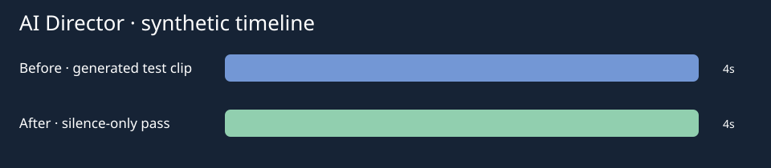

# AI Director



A small video-editing workflow prototype for turning a talking-head clip into
reviewable edit decisions and common interchange outputs.

## Workflow

```text
Video → FFmpeg audio extraction → silence detection → optional Whisper
      → optional semantic cuts → timeline → SRT / EDL / FCPXML → review/render
```

## What exists

- FFmpeg audio extraction and silence detection.
- Optional OpenAI-compatible Whisper transcription.
- Optional DeepSeek-compatible semantic cut suggestions.
- SRT, CMX3600 EDL and FCPXML generation.
- Optional local Premiere Pro bridge.

## Quick start

Requirements: Python 3.10+, FFmpeg and FFprobe. Optional provider credentials
are local-only; copy `.env.example` and never commit a real key.

```bash
python3 -m venv .venv
. .venv/bin/activate
pip install -r requirements.txt
python ai_director.py path/to/synthetic-sample.mp4 --silence-only --no-video --no-launch-pr
```

The repository contains no real video, voice or customer material. Create a
5–10 second synthetic clip locally for a smoke run.

A four-second FFmpeg-generated [synthetic input](examples/synthetic-input.mp4)
and [sample timeline output](examples/sample-keep-list.json) are included for
repeatable offline inspection. Run the documented command with this sample to
exercise audio extraction, silence detection and interchange export.

## Output and truth boundary

The tool emits edit artifacts for review. Provider-backed transcription,
semantic quality, Premiere import and final-video quality are not proven by the
offline unit tests. Do not treat generated cuts as an automatic publishing
decision.

## Verification

```bash
PYTHONPATH=. python3 -m unittest discover -s tests -p 'test_*.py'
python3 -m compileall -q ai_director.py modules pr_agent
```

## Status

Public prototype. The deterministic timeline helpers are testable locally;
external provider, media and Premiere integrations remain environment-dependent.

## License

MIT. See [LICENSE](LICENSE).

See [architecture](docs/architecture.md), [resume bullets](docs/resume-bullets.md)
and [interview notes](docs/interview-notes.md). No provider-backed transcript
or semantic edit quality is claimed by the synthetic sample.
